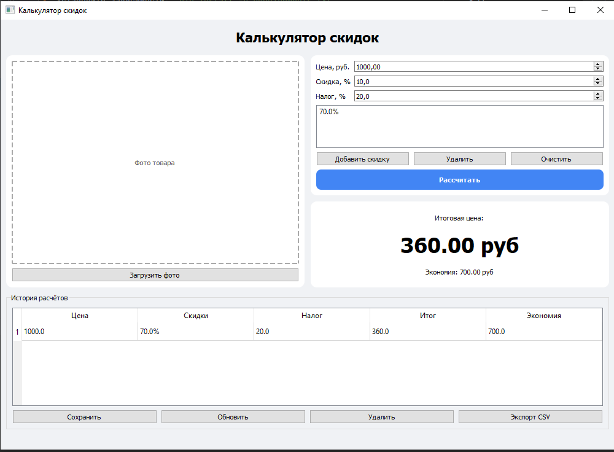

# PyQt5 Practice: Калькулятор скидок

Приложение для расчёта итоговой цены товара с учётом скидок и налога.  
Проект выполнен на Python с использованием PyQt5, SQLite и Pillow.

Приложение позволяет рассчитывать цену товара после одной или нескольких скидок, учитывать налог, сохранять историю расчётов и экспортировать данные в CSV.

## Демонстрация



## Возможности

- расчёт итоговой цены товара;
- каскадные, то есть множественные скидки;
- учёт налога;
- загрузка фото товара или ценника через Pillow;
- история расчётов в SQLite;
- добавление, обновление и удаление записей;
- экспорт истории расчётов в CSV;
- горячие клавиши для основных действий;
- подтверждение выхода из приложения.

## Горячие клавиши

| Клавиша | Действие |
|---|---|
| `Ctrl+R` | Выполнить расчёт |
| `Ctrl+S` | Сохранить расчёт в историю |

## Структура проекта

## Структура проекта

```text
discount_calculator/
├── main.py              # Точка входа, запуск QApplication
├── design.py            # Интерфейс, сигналы и обработка событий
├── database.py          # Работа с SQLite, CRUD-операции
├── requirements.txt     # Зависимости проекта
├── .gitignore           # Исключения для Git
├── TEST_PLAN.md         # Базовый тест-план
├── screenshot.png       # Скриншот интерфейса программы
└── README.md            # Описание проекта и инструкция по запуску